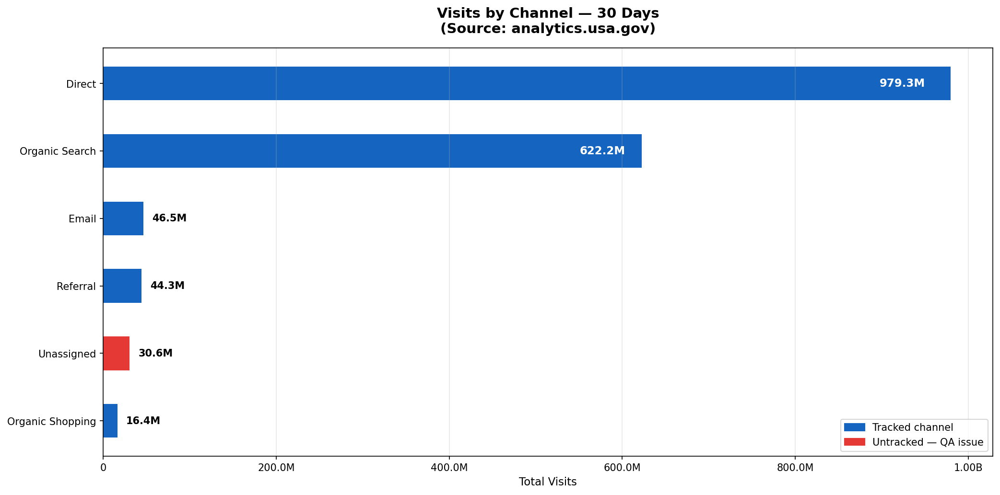
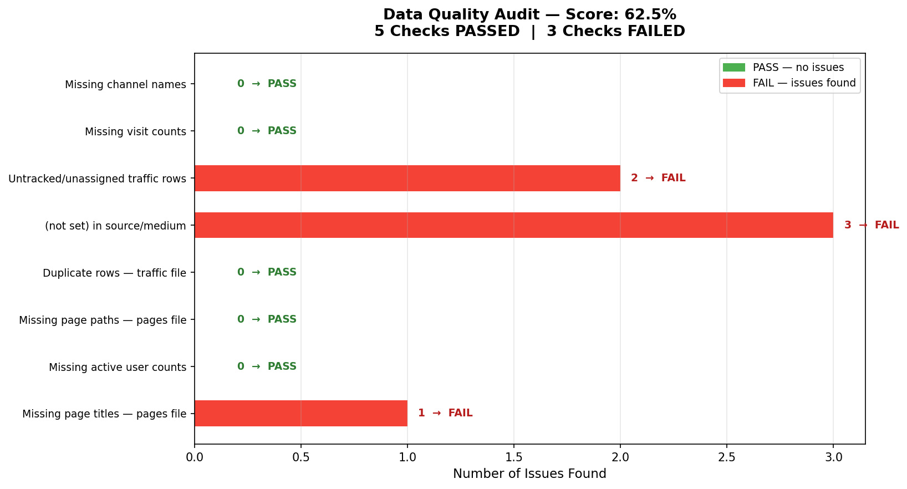
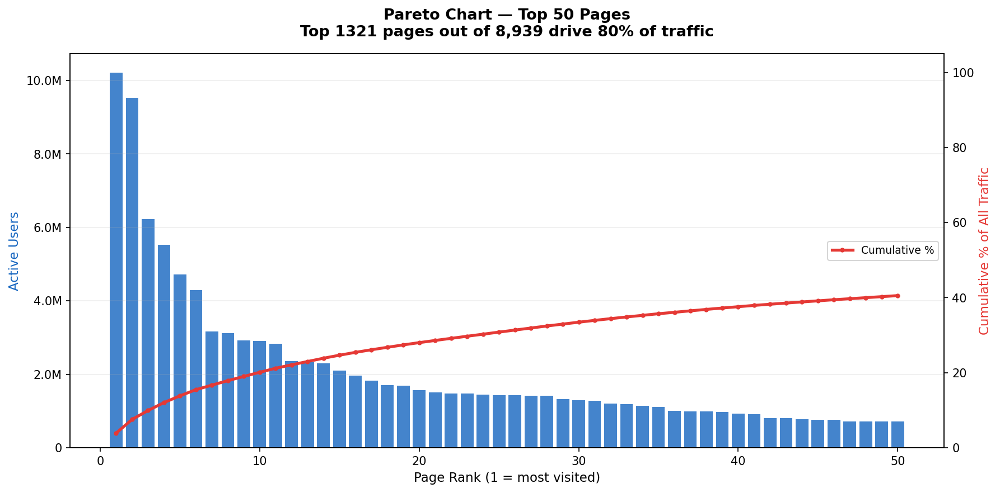

# US Government Website Traffic Analysis

**Binod Kumar Jena | Data Analyst Portfolio Project**

## Dataset
Real live data from analytics.usa.gov
3 CSV files — no account needed, free download

- top-traffic-sources-30-days.csv
- top-pages-by-active-user-7-days.csv
- top-10000-pages-and-screens-30-days.csv

## Project Summary
- Real US Government website analytics data
- 1.7 billion+ visits analysed across 30 days
- 10,000 pages analysed by active users
- 8-point automated data quality audit

## Key Findings
- Direct traffic dominates at **56.3%** of all visits
- Organic Search is second at **31.2%**
- Unassigned traffic flagged as **data governance risk**
- Top pages: USPS tracking with **10M+ active users**
- Pareto finding: top pages drive **80% of all traffic**
- Data quality score: **62.5%** (5 PASS / 3 FAIL)

## Tools Used
Python | Pandas | Matplotlib | Power BI

## Charts Preview

## Files
| File | Description |
|------|-------------|
| US_Government_Website_Traffic.ipynb | Full Python notebook |
| chart1 to chart6 .png | Individual dashboard charts |
| p1_*.csv | Clean data exports for Power BI |

## How to Run
1. Download 3 CSV files from analytics.usa.gov
2. Upload to Google Colab
3. Open notebook and run all cells
